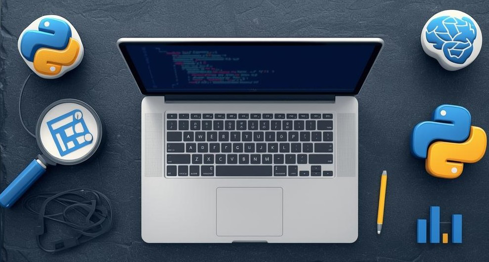

# 🐍 Python for Data Science & AI Engineering

**From Zero to Professional | Complete Hands-On Course**



---

## 👋 Welcome, Future Data Scientist!

Hey there! Welcome to your journey into Python for Data Science and AI Engineering. Whether you're completely new to programming or brushing up your skills, this course has got you covered.

Think of Python as your Swiss Army knife for data work. It's the language that powers Netflix recommendations, self-driving cars, and those eerily accurate product suggestions on Amazon. Pretty cool, right?

By the end of this course, you'll write Python code confidently, manipulate data like a pro, and have the foundation to tackle machine learning projects.

---

## 🎯 What You'll Learn

| Module | Topics Covered | Duration |
|--------|---------------|----------|
| 01 | Python Fundamentals | 2 weeks |
| 02 | Data Structures Deep Dive | 2 weeks |
| 03 | Functions and Modules | 1.5 weeks |
| 04 | Object-Oriented Programming | 2 weeks |
| 05 | File Handling and I/O | 1 week |
| 06 | Error Handling and Debugging | 1 week |
| 07 | NumPy for Numerical Computing | 2 weeks |
| 08 | Pandas for Data Manipulation | 2.5 weeks |
| 09 | Working with APIs and Web Data | 1.5 weeks |
| 10 | Python Best Practices for DS/AI | 1 week |

**Total Duration:** 16-18 weeks (self-paced)

---

## 🏗️ Course Structure
```
python-for-data-science/
│
├── README.md
├── CONTRIBUTING.md
├── LICENSE
│
├── modules/
│ ├── 01-python-fundamentals/
│ │ ├── lessons/
│ │ ├── practice/
│ │ ├── quizzes/
│ │ └── projects/
│ ├── 02-data-structures/
│ └── ... (more modules)
│
├── assets/
│ ├── images/
│ ├── infographics/
│ ├── flashcards/
│ └── slides/
│
├── projects/
│ ├── beginner/
│ ├── intermediate/
│ └── advanced/
│
├── resources/
│ ├── cheatsheets/
│ ├── references/
│ └── datasets/
│
└── solutions/
└── (password protected)
```

---

## 🎓 Who Is This Course For?

✅ **Complete beginners** with zero programming experience  
✅ **Students** studying data science, computer science, or related fields  
✅ **Professionals** transitioning into data science or AI  
✅ **Analysts** who want to upgrade from Excel to Python  
✅ **Self-learners** who want a structured, comprehensive resource  

---

## 📋 Prerequisites

- A computer (Windows, Mac, or Linux)
- Internet connection
- Curiosity and willingness to practice
- Basic math skills (addition, subtraction, multiplication, division)

That's it! No prior programming experience needed.

---

## 🛠️ Setup Requirements

| Tool | Purpose | Installation Guide |
|------|---------|-------------------|
| Python 3.10+ | Programming Language | [Guide](setup/python-install.md) |
| VS Code or PyCharm | Code Editor | [Guide](setup/editor-setup.md) |
| Anaconda/Miniconda | Environment Management | [Guide](setup/anaconda-setup.md) |
| Git | Version Control | [Guide](setup/git-setup.md) |
| Jupyter Notebook | Interactive Coding | [Guide](setup/jupyter-setup.md) |

---

## 📊 Learning Path Visualization
```

START HERE
│
▼
┌─────────────────┐
│ Module 01-03 │ ◄── Foundation Phase (5.5 weeks)
│ Python Basics │ Learn syntax, data types, functions
└────────┬────────┘
│
▼
┌─────────────────┐
│ Module 04-06 │ ◄── Intermediate Phase (4 weeks)
│ OOP & Files │ Build robust, maintainable code
└────────┬────────┘
│
▼
┌─────────────────┐
│ Module 07-08 │ ◄── Data Science Phase (4.5 weeks)
│ NumPy & Pandas │ Work with real datasets
└────────┬────────┘
│
▼
┌─────────────────┐
│ Module 09-10 │ ◄── Professional Phase (2.5 weeks)
│ APIs & Best │ Industry-ready skills
│ Practices │
└────────┬────────┘
│
▼
🎉 COMPLETE!

Ready for ML/AI
```

---

## 📈 Progress Tracking

Use this checklist to track your progress:

- [ ] Module 01: Python Fundamentals
- [ ] Module 02: Data Structures Deep Dive
- [ ] Module 03: Functions and Modules
- [ ] Module 04: Object-Oriented Programming
- [ ] Module 05: File Handling and I/O
- [ ] Module 06: Error Handling and Debugging
- [ ] Module 07: NumPy for Numerical Computing
- [ ] Module 08: Pandas for Data Manipulation
- [ ] Module 09: Working with APIs and Web Data
- [ ] Module 10: Python Best Practices for DS/AI
- [ ] Final Capstone Project

---

## 💡 How to Use This Course

1. **Follow the order** - Modules build on each other
2. **Type the code yourself** - Don't just copy-paste
3. **Complete all practices** - Repetition builds muscle memory
4. **Take the quizzes** - Test your understanding
5. **Build the projects** - Apply what you learn
6. **Ask questions** - Use the Discussions tab

---

## 🤝 Community and Support

- **Discussions:** Use GitHub Discussions for questions
- **Issues:** Report bugs or suggest improvements
- **Discord:** [Join our community](#) (optional)

---

## 📜 License

This course is released under the MIT License. Feel free to use, modify, and share.

---

## 🙏 Acknowledgments

This course draws inspiration from:
- Kaggle Learn
- IBM SkillsBuild
- Official Python Documentation
- Real-world data science practices

---

**Ready to start? Head to [Module 01: Python Fundamentals](modules/01-python-fundamentals/README.md)!**

---

*Last Updated: January 2025*  
*Version: 1.0.0*

<div align="center">
Made with ❤️ for the Data Science & AI Community


</div>
