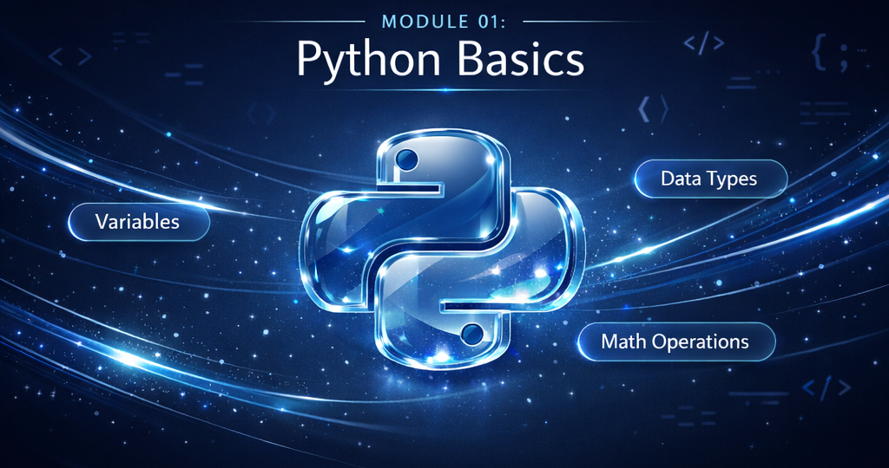

# Module 01: Python Fundamentals



---

## 🎯 Module Overview

Welcome to your first step into Python! This module covers everything you need to write your first programs. We'll take it slow, explain everything clearly, and make sure you understand not just the "how" but also the "why."

**Estimated Time:** 2 weeks (10-15 hours)

---

## 📚 Lessons in This Module

| Lesson | Topic | Duration | Status |
|--------|-------|----------|--------|
| 1.1 | What is Python and Why Learn It? | 30 min | ⬜ |
| 1.2 | Setting Up Your Environment | 45 min | ⬜ |
| 1.3 | Your First Python Program | 30 min | ⬜ |
| 1.4 | Variables and Data Types | 60 min | ⬜ |
| 1.5 | Numbers and Math Operations | 45 min | ⬜ |
| 1.6 | Strings and Text Manipulation | 60 min | ⬜ |
| 1.7 | Input and Output | 30 min | ⬜ |
| 1.8 | Comments and Code Documentation | 20 min | ⬜ |
| 1.9 | Basic Operators | 45 min | ⬜ |
| 1.10 | Module Summary and Review | 30 min | ⬜ |

---

## 🎓 Learning Objectives

By the end of this module, you will be able to:

✅ Explain what Python is and why it's popular in data science  
✅ Set up a Python development environment  
✅ Write and run basic Python programs  
✅ Work with variables and different data types  
✅ Perform mathematical operations  
✅ Manipulate text using strings  
✅ Get input from users and display output  
✅ Write clean, documented code  

---

## 🗺️ Module Roadmap
```
Lesson 1.1 ──► Lesson 1.2 ──► Lesson 1.3
(Why Python) (Setup) (Hello World)
│
▼
Lesson 1.6 ◄── Lesson 1.5 ◄── Lesson 1.4
(Strings) (Numbers) (Variables)
│
▼
Lesson 1.7 ──► Lesson 1.8 ──► Lesson 1.9 ──► Lesson 1.10
(I/O) (Comments) (Operators) (Summary)
│
▼
✅ Module Complete!
```

---

## 📂 Folder Structure
```
01-python-fundamentals/
├── README.md (you are here)
├── lessons/
│ ├── 1.1-what-is-python.md
│ ├── 1.2-environment-setup.md
│ ├── 1.3-first-program.md
│ ├── 1.4-variables-datatypes.md
│ ├── 1.5-numbers-math.md
│ ├── 1.6-strings.md
│ ├── 1.7-input-output.md
│ ├── 1.8-comments.md
│ ├── 1.9-operators.md
│ └── 1.10-module-summary.md
├── practice/
│ ├── practice-1.1.md
│ ├── practice-1.2.md
│ └── ...
├── quizzes/
│ ├── quiz-1.md
│ └── quiz-2.md
├── projects/
│ └── mini-project-calculator.md
└── resources/
├── cheatsheet.md
└── flashcards.md
```

---

**Let's begin! → [Lesson 1.1: What is Python and Why Learn It?](lessons/1.1-what-is-python.md)**
